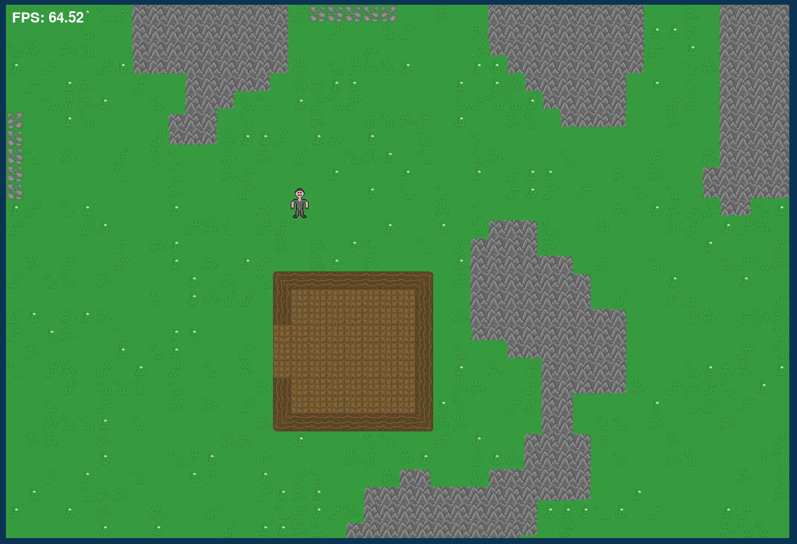
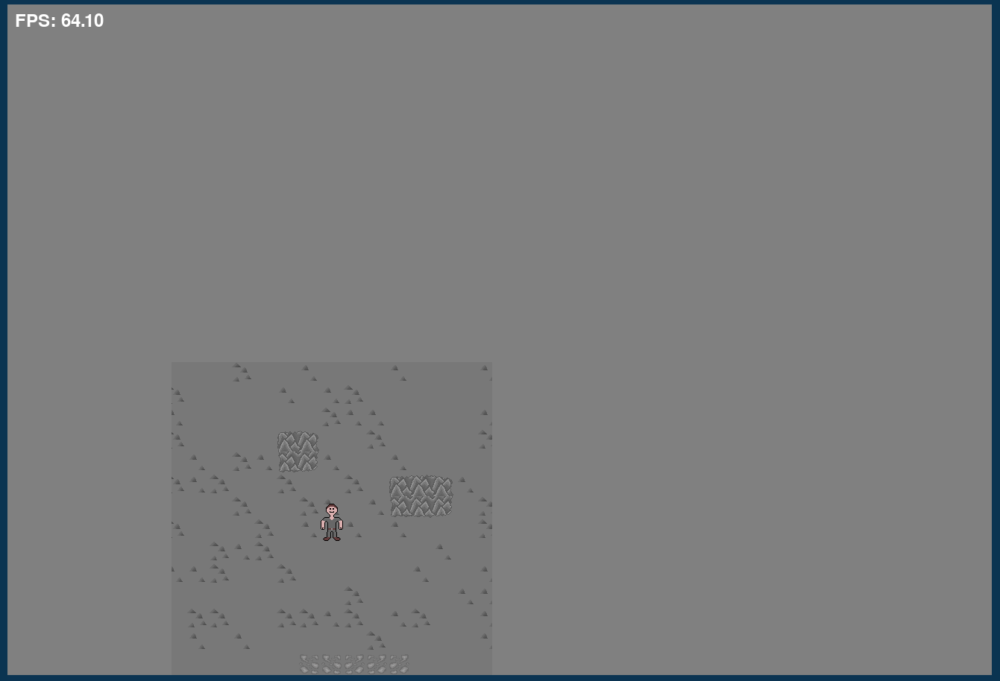
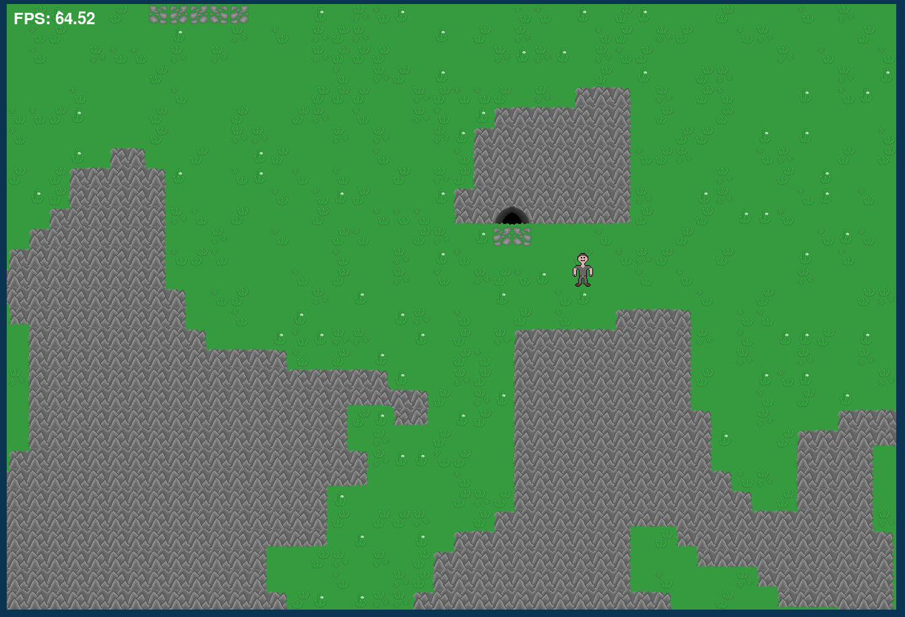
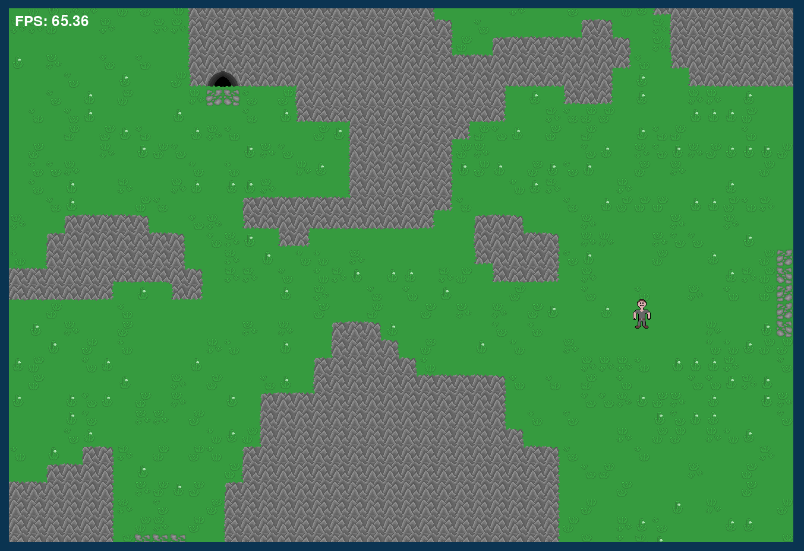

# MapGenerator
Graphics engine used to generate 2D maps for games with a resolution of 1920x1080 along with collisions. The project has been implemented with the ability to move the character and move between maps, each of which is unique.

## Table of Contents
* [General info](#general-info)
* [Technologies Used](#technologies-used)
* [Setup](#setup)
* [Screenshots](#screenshots)
* [Game Controls](#game-controls)
* [Project Status](#project-status)
* [Sources](#sources)

## General info
I created a simple graphic engine that generates 2D maps based on my own idea. Thanks to this project, I deepened my skills in object-oriented programming and integrating Python with C++ code.

## Technologies Used
Project is created with:
* Python version: 3.11
* Pygame version: 2.6.1
* NumPy version: 2.2.3
* PyCharm Community Edition
* Gimp
* MinGw-w64

## Setup
To run this project, create new empty project in PyCharm editor, copy all files and put command below in PyCharm terminal:
```
pip install -r .\requirements.txt
```

## Screenshots
### Sample screenshots from the game:
##### Sample map with house

##### Inside cave

##### Sample map with cave entrance

##### Another example of map


## Game Controls

### Movement:
- **Go left:** `A` key 
- **Go right:** `D` key
- **Go up:** `W` key
- **Go down:** `S` key

### Game quit:
- **Press `Esc` key**  

## Project Status
Project is complete. I currently have no plans to further develop the game engine, as I have achieved the intended learning outcomes

## Sources
The idea, graphics and the project itself are completely original, I did not use any external sources during its creation
